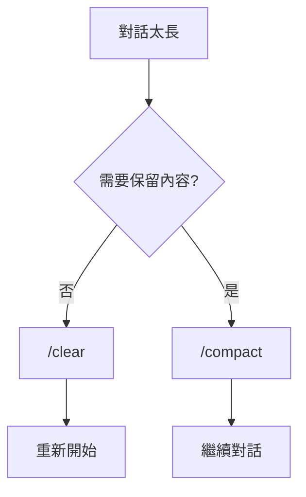
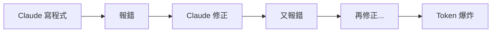

# Claude Code 省 Token 心法

讓你的 Quota 用得更聰明

---
layout: section
---

# 01

隨時知道自己的 Quota

---
layout: two-cols
---

# 像記帳一樣管理 Token

就像去日本鄉下玩，你會隨時看一下錢包裡還剩多少日幣

<v-clicks>

- **想確認時再看** → 使用 Skill
  <br>推薦 `skills/IT` 這個 Repo
- **使用 Claude Code 時想看** → Status Line
- **隨時都想看** → Mac App

</v-clicks>

::right::

<div class="flex items-center justify-center h-full">
<div class="text-8xl">💰</div>
</div>

---
layout: section
---

# 02

善用 Tool Search 動態載入

---

# MCP 工具的 Token 成本

每增加一個 MCP 伺服器，都會注入大量 JSON Schema 定義

<v-click>

**好消息：新版 Claude Code 支援 Tool Search！**

</v-click>

<v-clicks>

- 代理不再預先載入所有工具定義
- 被提供一個「工具搜尋」工具
- 當需要特定能力時動態載入

</v-clicks>

<v-click>

設定方式：`ENABLE_TOOL_SEARCH=true`

</v-click>

---
layout: section
---

# 03

管理你的上下文

---
layout: two-cols
---

# 清除與壓縮

<v-clicks>

- **/clear** - 完全清除上下文
  - 當對話偏離主題時使用
  - 開始新任務時使用
- **/compact** - 壓縮上下文
  - 保留重要資訊
  - 減少 Token 消耗

</v-clicks>

::right::



---
layout: section
---

# 04

選擇合適的模型

---

# 沒必要的就用便宜模型

**Plan 時用 Opus，動手時用 Sonnet**

<v-click>

| 任務類型 | 推薦模型 | 原因 |
|---------|---------|------|
| 規劃、設計 | Opus | 需要深度思考 |
| 寫程式碼 | Sonnet | 執行力足夠 |
| 簡單查詢 | Haiku | 快速便宜 |

</v-click>

<v-click>

> 順便推薦：CopilotWeb 的各種 Skills 也很好用！

</v-click>

---
layout: section
---

# 05

保持更新 & 監控狀態

---
layout: two-cols
---

# 保持 Claude Code 更新

<v-clicks>

- 新版本通常有效能優化
- 可能有新的省 Token 功能
- 目前會自動通知更新

</v-clicks>

::right::

# 用狀態列監控上下文

<v-clicks>

- Terminal 顯示當前用量
- VSCode 內也會顯示
- 隨時掌握消耗狀況

</v-clicks>

---
layout: section
---

# 06

及時糾正偏離的 Claude

---
layout: center
---

# 一旦發現 Claude 偏離軌道

# 請立即糾正！

<v-click>

越早糾正，浪費的 Token 越少

</v-click>

---
layout: section
---

# 07

善用 CLAUDE.md

---

# CLAUDE.md 漸進式揭露

不要一次把所有資訊塞進 CLAUDE.md

<v-clicks>

- **基礎設定** → 全域 CLAUDE.md
- **專案設定** → 專案 CLAUDE.md
- **特定任務** → 在對話中補充

</v-clicks>

<v-click>

這樣可以減少每次對話的基礎 Token 消耗

</v-click>

---
layout: section
---

# 08

子代理與上下文隔離

---

# Sub-agents 的威力

對於極其複雜的任務，單一會話的上下文很快就會飽和

<v-click>

**利用 Claude Code 的子代理功能：**

</v-click>

<v-clicks>

- 每個子代理有獨立的上下文
- 完成後只回傳結果
- 主對話保持精簡

</v-clicks>

---
layout: section
---

# 09

One Task, One Session

---
layout: center
class: text-center
---

# 原則

<div class="text-6xl font-bold mt-8">One Task, One Session</div>

<v-click>

<div class="mt-8 text-2xl">一個任務，一個會話<br>避免在同一會話中處理太多不相關的事</div>

</v-click>

---
layout: section
---

# 10

Plan Mode：避免 Token 死亡螺旋

---

# 最浪費 Token 的情境



<v-click>

這通常是因為**一開始的理解不足或路徑錯誤**

</v-click>

---

# Plan Mode 的價值

雖然推理過程消耗 Token，但它能大幅減少後續的「重寫成本」

<v-click>

## Do it right first time

**一次做對，永遠是最省 Token 的策略**

</v-click>

---
layout: section
---

# 11

One-shot Prompting

---

# 盡量一次說清楚

**問題：** 多輪對話會產生大量的「對話頭尾」開銷

<v-click>

**解法：** 將背景資訊、需求、限制條件在一個 Prompt 中說清楚

</v-click>

<v-click>

```markdown
# 好的 Prompt 範例
請幫我實作一個登入功能：
- 使用 JWT 驗證
- 支援 Google OAuth
- 錯誤時顯示中文訊息
- 參考 src/auth/ 目錄的現有程式碼風格
```

</v-click>

---
layout: center
class: text-center
---

# 總結

<div class="grid grid-cols-3 gap-4 mt-8 text-left">
<div class="p-4 bg-blue-900 rounded"><div class="font-bold mb-2">監控</div><div class="text-sm">隨時知道 Quota</div></div>
<div class="p-4 bg-green-900 rounded"><div class="font-bold mb-2">管理</div><div class="text-sm">/clear 與 /compact</div></div>
<div class="p-4 bg-purple-900 rounded"><div class="font-bold mb-2">選擇</div><div class="text-sm">合適的模型</div></div>
<div class="p-4 bg-orange-900 rounded"><div class="font-bold mb-2">規劃</div><div class="text-sm">Plan Mode 先行</div></div>
<div class="p-4 bg-pink-900 rounded"><div class="font-bold mb-2">隔離</div><div class="text-sm">Sub-agents 分工</div></div>
<div class="p-4 bg-cyan-900 rounded"><div class="font-bold mb-2">精準</div><div class="text-sm">One-shot Prompting</div></div>
</div>

---
layout: section
---

# 下回預告

---
layout: center
---

# 下回預告

就像玩電動的時候，通常會去看網路上的大神怎麼配裝備

<v-click>

**分享一些配到自己專案之中的設定**

</v-click>

<v-click>

敬請期待！

</v-click>

---
layout: end
class: text-center
---

# 謝謝！

有問題歡迎討論
